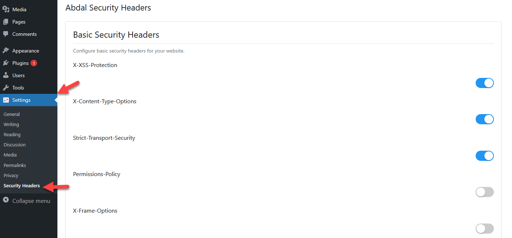

# 🛡️ هدرهای امنیتی ابدال - راهنمای کاربر

  

[English Guide](README.md)

[English User Guide](README_User_en.md) | [English Developer Guide](README_Developer_en.md) | [Persian Developer Guide](README_Developer_fa.md)

## 📝 مقدمه
به هدرهای امنیتی ابدال خوش آمدید! این افزونه وردپرس با افزودن هدرهای امنیتی ضروری، به محافظت از وب‌سایت شما کمک می‌کند. این راهنما به شما کمک می‌کند تا با افزونه شروع به کار کنید و از تمام ویژگی‌های آن بهره‌مند شوید.

## ✨ این افزونه چه کار می‌کند

### حفاظت امنیتی
- 🔒 محافظت در برابر حملات cross-site scripting (XSS)
- 🛡️ جلوگیری از تلاش‌های clickjacking
- 🔐 توقف حملات MIME-type sniffing
- 🌐 اجبار اتصالات امن HTTPS
- 🚫 کنترل اشتراک‌گذاری اطلاعات حساس
- 🛑 مدیریت منابع قابل بارگذاری در سایت

### ویژگی‌های آسان
- 📝 کلیدهای ساده برای فعال/غیرفعال کردن ویژگی‌های امنیتی
- 👁️ پیش‌نمایش آنی تنظیمات امنیتی
- 🎨 رابط کاربری دوستانه با گزینه‌های واضح
- ✅ اعتبارسنجی خودکار تنظیمات امنیتی
- 📊 نظارت بر وضعیت امنیتی

### یکپارچه‌سازی با وردپرس
- 🎭 گزینه مخفی کردن نسخه وردپرس
- ⚡ پاکسازی هدرهای غیرضروری
- 🔌 محافظت از API های وردپرس
- 🔑 کنترل دسترسی به سایت
- 📢 ویژگی‌های حریم خصوصی پیشرفته

### تجربه کاربری
- 💫 طراحی رابط مدرن و تمیز
- 🎛️ تنظیمات سازمان‌یافته در بخش‌های مشخص
- 🌐 پشتیبانی از زبان‌های راست به چپ
- 💡 نکات و توضیحات مفید
- 🎯 گزینه‌های ساده و قابل فهم

### مزایای اضافی
- 📱 عملکرد عالی در دستگاه‌های موبایل
- 🔄 پشتیبان‌گیری و بازیابی تنظیمات
- 📝 پیام‌های خطا و هشدار واضح
- ⚙️ گزینه‌های پیکربندی انعطاف‌پذیر
- 🛠️ سازگار با سایر افزونه‌های امنیتی

## 🚀 شروع به کار
1. افزونه را از داشبورد وردپرس نصب کنید
2. به بخش `تنظیمات -> هدرهای امنیتی` بروید
3. ویژگی‌های امنیتی مورد نظر خود را فعال کنید
4. تنظیمات را ذخیره کنید

## ⚙️ تنظیمات پایه
- **X-XSS-Protection**: از حملات cross-site scripting جلوگیری می‌کند
- **X-Frame-Options**: از تلاش‌های clickjacking جلوگیری می‌کند
- **X-Content-Type-Options**: از MIME-type sniffing جلوگیری می‌کند
- **Strict-Transport-Security**: اتصالات HTTPS را اجباری می‌کند
- **Content Security Policy**: کنترل می‌کند که چه منابعی می‌توانند بارگذاری شوند

## 🔰 تنظیمات پیشنهادی
برای محافظت پایه، پیشنهاد می‌کنیم موارد زیر را فعال کنید:
1. تمام هدرهای امنیتی پایه
2. مخفی کردن نسخه وردپرس
3. حذف هدرهای غیرضروری
4. Content Security Policy پایه

## ❓ سوالات متداول
1. **آیا این افزونه با کش‌ها سازگار است؟**
   - بله، با تمام افزونه‌های کش معروف کار می‌کند

2. **آیا این افزونه وب‌سایت من را خراب می‌کند؟**
   - خیر، تنظیمات پیش‌فرض برای اکثر وب‌سایت‌ها امن است

3. **آیا به دانش فنی نیاز دارم؟**
   - خیر، رابط کاربری ساده است و راهنمایی‌های مفیدی دارد

## 🐛 گزارش مشکلات
اگر با مشکلی مواجه شدید یا در پیکربندی مشکل دارید، لطفاً از طریق ایمیل Prof.Shafiei@Gmail.com با ما در تماس باشید. همچنین می‌توانید مشکلات را در GitLab یا GitHub گزارش دهید.

## ❤️ حمایت مالی
اگر این پروژه برای شما مفید بود و مایل به حمایت از توسعه بیشتر هستید، لطفاً در نظر داشته باشید که کمک مالی کنید:
- [اینجا اهدا کنید](https://alphajet.ir/abdal-donation)

## 🤵 برنامه‌نویس
ساخته شده با عشق توسط **ابراهیم شفیعی (EbraSha)**
- **ایمیل**: Prof.Shafiei@Gmail.com
- **تلگرام**: [@ProfShafiei](https://t.me/ProfShafiei)

## 📜 مجوز
این پروژه تحت مجوز GPLv2 or later منتشر شده است.

 