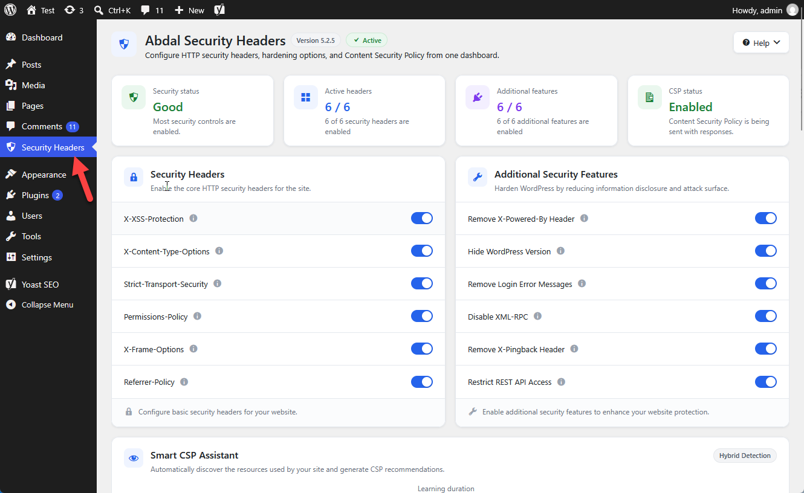

# 🛡️ Abdal Security Headers — Developer Guide

<div align="center">
  
</div>

[Persian Developer Guide](README_Developer_fa.md) · [English User Guide](../README.md) · [Persian User Guide](../README_fa.md)

## 🧠 Smart CSP Assistant

Hybrid discovery only. Findings are stored separately from `ash_options`. CSP fields change only when an admin applies selected sources (merge, never replace).

| Layer | Role |
| --- | --- |
| Static | WordPress-registered scripts, styles, media, REST/AJAX endpoints |
| Report-Only | `Content-Security-Policy-Report-Only` while observing; blocking CSP is skipped during learning |
| Runtime | Frontend observer for dynamic loads |

Learning duration: `15min`, `1hour`, `6hours`, `24hours`, `manual`. Optional continuous monitoring after learning.

Display status **Added** means the origin is already covered by the matching CSP field (`'self'`, host, wildcard). Dangerous tokens require confirmation. Unknown types stay for review and are not auto-applied.

## 📁 Project structure

```
abdal-security-headers/
├── abdal-security-headers.php
├── includes/
│   ├── class-ash-admin.php
│   ├── class-ash-admin-ui.php
│   ├── class-ash-headers.php
│   ├── class-ash-csp-assistant.php
│   ├── class-ash-csp-normalizer.php
│   ├── class-ash-csp-repository.php
│   └── class-ash-csp-static-detector.php
├── assets/css/admin.css
├── assets/js/admin.js
├── assets/js/csp-assistant.js
├── assets/js/csp-runtime-observer.js
└── languages/
```

Discovery table: `{prefix}ash_csp_sources`. Assistant state option: `ash_csp_assistant_state`.

## 🔧 Key classes

- `ASH_Headers` — sends headers; skips blocking CSP while the assistant is learning
- `ASH_Admin` / `ASH_Admin_UI` — top-level menu, settings UI, CSP editor modal
- `ASH_CSP_Assistant` — learning, Report-Only, AJAX apply/diff/ignore
- `ASH_CSP_Normalizer` — origin extraction, classification, policy coverage
- `ASH_CSP_Repository` — persist and merge detections
- `ASH_CSP_Static_Detector` — registered asset scan

Admin AJAX: `ash_csp_assistant_*`. Public collectors: `ash_csp_report`, `ash_csp_runtime`.

## 🚀 Setup

1. Copy the plugin into `wp-content/plugins/abdal-security-headers`
2. Activate it
3. Open **Security Headers** in wp-admin

Requires WordPress 5.0+ and PHP 7.2+. No Composer dependencies.

## 🐛 Reporting Issues

If you encounter any issues or have configuration problems, please reach out via email at Prof.Shafiei@Gmail.com. You can also report issues on GitLab or GitHub.

## ❤️ Donation

If you find this project helpful and would like to support further development, please consider making a donation:
- [Donate Here](https://t.me/AbdalDonationBot)

## 🤵 Programmer

Handcrafted with Passion by **Ebrahim Shafiei (EbraSha)**
- **E-Mail**: Prof.Shafiei@Gmail.com
- **Telegram**: [@ProfShafiei](https://t.me/ProfShafiei)

## 📜 License

This project is licensed under the GPLv2 or later License.
