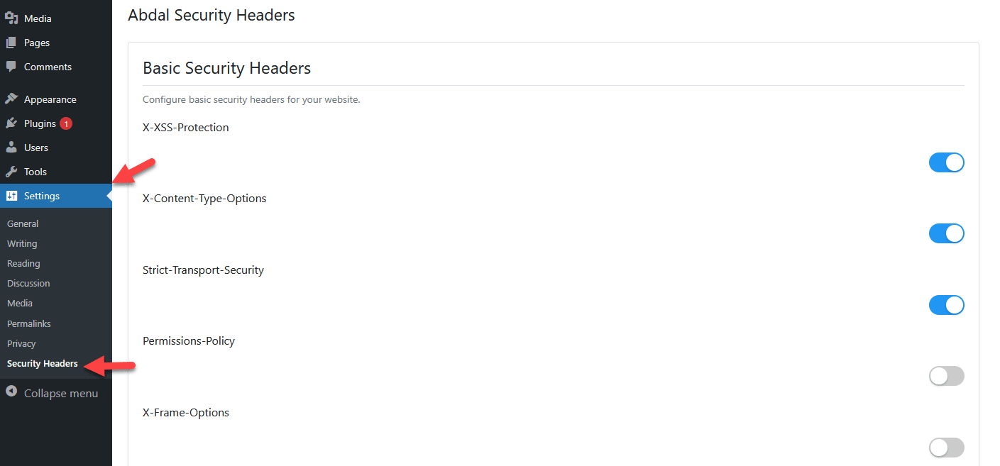

# 🛡️ هدرهای امنیتی ابدال

<div align="center">
  
</div>

[English Developer Guide](README_Developer_en.md) | [English User Guide](README_User_en.md) | [Persian User Guide](README_User_fa.md)

<div dir="rtl">

## 📝 توضیحات
افزونه هدرهای امنیتی ابدال یک افزونه وردپرس است که با پیاده‌سازی و مدیریت هدرهای امنیتی HTTP، امنیت وب‌سایت شما را افزایش می‌دهد. این افزونه یک رابط کاربری ساده برای پیکربندی هدرهای امنیتی و دستورات Content Security Policy (CSP) ارائه می‌دهد.

## ✨ ویژگی‌ها
### مدیریت هدرهای امنیتی
- 🔒 هدر X-XSS-Protection برای جلوگیری از حملات cross-site scripting
- 🛡️ هدر X-Frame-Options برای جلوگیری از clickjacking
- 🔐 هدر X-Content-Type-Options برای جلوگیری از MIME-type sniffing
- 🌐 هدر Strict-Transport-Security (HSTS) برای اجبار اتصالات HTTPS
- 🚫 هدر Referrer-Policy برای کنترل نشت اطلاعات
- 🛑 سیاست امنیتی محتوا (CSP) با پیش‌نمایش و پیکربندی آنی

### ویژگی‌های سیاست امنیتی محتوا
- 📝 ویرایشگر بصری دستورات CSP
- 👁️ پیش‌نمایش آنی هدر CSP
- 🎨 هایلایت کردن سینتکس دستورات CSP
- ✅ اعتبارسنجی سینتکس CSP
- 📊 تنظیم گزارش‌گیری تخلفات CSP

### بهبودهای امنیتی وردپرس
- 🎭 مخفی کردن اطلاعات نسخه وردپرس
- ⚡ حذف هدرهای غیرضروری
- 🔌 محافظت از XML-RPC
- 🔑 کنترل دسترسی REST API
- 📢 مخفی کردن اطلاعات سرور

### رابط کاربری
- 💫 رابط کاربری مدرن با کلیدهای سبک iOS
- 🎛️ بخش‌های آکاردئونی برای سازماندهی بهتر
- 🌐 پشتیبانی کامل از RTL برای سایت‌های چندزبانه
- 💡 راهنمایی‌ها و مستندات مفید
- 🎯 پنل تنظیمات کاربرپسند

### ویژگی‌های اضافی
- 📱 رابط مدیریت واکنش‌گرا برای موبایل
- 🔄 قابلیت درون‌ریزی/برون‌ریزی تنظیمات
- 📝 ثبت جزئیات رویدادهای امنیتی
- ⚙️ کنترل دقیق روی هر ویژگی امنیتی
- 🛠️ هوک‌ها و فیلترهای مناسب برای توسعه‌دهندگان

## 🚀 نصب
1. فایل‌های افزونه را در مسیر `/wp-content/plugins/abdal-security-headers` آپلود کنید
2. افزونه را از طریق صفحه افزونه‌های وردپرس فعال کنید
3. از مسیر `تنظیمات -> هدرهای امنیتی` برای پیکربندی افزونه استفاده کنید

## ⚙️ پیکربندی
1. به بخش `تنظیمات -> هدرهای امنیتی` در پنل مدیریت وردپرس بروید
2. هدرهای امنیتی مورد نظر را با استفاده از کلیدها فعال/غیرفعال کنید
3. در صورت نیاز دستورات CSP را پیکربندی کنید
4. تنظیمات را ذخیره کنید

## 🔧 پیش‌نیازها
- وردپرس 5.0 یا بالاتر
- PHP 7.2 یا بالاتر
- مرورگر وب مدرن برای رابط مدیریت

## 🐛 گزارش مشکلات
اگر با مشکلی مواجه شدید یا در پیکربندی مشکل دارید، لطفاً از طریق ایمیل Prof.Shafiei@Gmail.com با ما در تماس باشید. همچنین می‌توانید مشکلات را در GitLab یا GitHub گزارش دهید.

## ❤️ حمایت مالی
اگر این پروژه برای شما مفید بود و مایل به حمایت از توسعه بیشتر هستید، لطفاً در نظر داشته باشید که کمک مالی کنید:
- [اینجا اهدا کنید](https://alphajet.ir/abdal-donation)

## 🤵 برنامه‌نویس
ساخته شده با عشق توسط **ابراهیم شفیعی (EbraSha)**
- **ایمیل**: Prof.Shafiei@Gmail.com
- **تلگرام**: [@ProfShafiei](https://t.me/ProfShafiei)

## 📜 مجوز
این پروژه تحت مجوز GPLv2 or later منتشر شده است - برای جزئیات بیشتر فایل LICENSE را مشاهده کنید.

</div>

## فهرست مطالب
- [معرفی](#معرفی)
- [نصب و راه‌اندازی](#نصب-و-راه‌اندازی)
- [ساختار پروژه](#ساختار-پروژه)
- [API ها و توابع کلیدی](#api-ها-و-توابع-کلیدی)
- [راهنمای مشارکت](#راهنمای-مشارکت)
- [عیب‌یابی](#عیب‌یابی)

## معرفی
پلاگین Abdal Security Headers یک افزونه امنیتی برای وردپرس است که امکان مدیریت هدرهای امنیتی و ویژگی‌های امنیتی اضافی را فراهم می‌کند.

## نصب و راه‌اندازی
1. کلون کردن مخزن:
```bash
git clone https://github.com/ebrasha/abdal-security-headers.git
```

2. نصب وابستگی‌ها:
```bash
composer install
```

3. کپی کردن فایل‌ها به پوشه plugins وردپرس

## ساختار پروژه
```
abdal-security-headers/
├── docs/                    # مستندات
├── includes/               # کلاس‌های اصلی
│   ├── class-ash-admin.php  # مدیریت پنل ادمین
│   └── class-ash-headers.php # پیاده‌سازی هدرها
├── languages/              # فایل‌های ترجمه
├── assets/                # فایل‌های CSS و JS
└── abdal-security-headers.php # فایل اصلی پلاگین
```

## API ها و توابع کلیدی

### کلاس ASH_Headers
مسئول مدیریت هدرهای امنیتی و ویژگی‌های امنیتی:

```php
// تنظیم هدرهای امنیتی
public function set_security_headers()

// غیرفعال‌سازی XML-RPC
public function ash_block_xmlrpc_access()

// محدود کردن REST API
public function ash_disable_rest_api()
```

### کلاس ASH_Admin
مدیریت رابط کاربری پنل ادمین:

```php
// ایجاد صفحه تنظیمات
public function create_admin_page()

// ثبت تنظیمات
public function page_init()
```

## راهنمای مشارکت
1. یک شاخه جدید برای ویژگی یا رفع باگ ایجاد کنید
2. تغییرات را اعمال کنید
3. تست‌ها را اجرا کنید
4. Pull Request ایجاد کنید

## عیب‌یابی
- فعال کردن WP_DEBUG در wp-config.php
- بررسی لاگ‌های خطا
- استفاده از ابزار بررسی هدرهای امنیتی مثل SecurityHeaders.com

برای اطلاعات بیشتر به [مستندات کامل](https://github.com/ebrasha/abdal-security-headers/wiki) مراجعه کنید. 